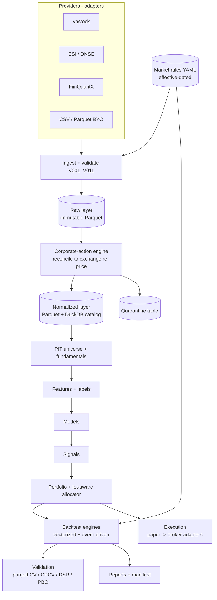

# ARCHITECTURE

> **Status:** Draft 0.1 · 2026-09-19
> **Package name:** `vnq` is a placeholder. Check PyPI, GitHub and trademark availability before committing.
> **Conventions:** MUST / SHOULD / MAY follow RFC 2119. Items tagged **[verify]** are Vietnamese market rules recalled from prior knowledge. Each one MUST be confirmed against the current circular or exchange notice before it is encoded in the rules files.
> **Companion document:** [ROADMAP.md](./ROADMAP.md)

---

## Table of contents

1. [Purpose, scope, non-goals](#1-purpose-scope-non-goals)
2. [Design principles](#2-design-principles)
3. [System overview](#3-system-overview)
4. [Market model (rules engine)](#4-market-model-rules-engine)
5. [Data layer](#5-data-layer)
6. [Research toolkit](#6-research-toolkit)
7. [Backtest engines](#7-backtest-engines)
8. [Portfolio and risk](#8-portfolio-and-risk)
9. [Execution](#9-execution)
10. [Package layout, public API, plugins](#10-package-layout-public-api-plugins)
11. [Testing strategy](#11-testing-strategy)
12. [Performance targets](#12-performance-targets)
13. [Security, licensing, legal](#13-security-licensing-legal)
14. [Documentation and i18n](#14-documentation-and-i18n)
15. [ADR index (proposed)](#15-adr-index-proposed)
16. [Open questions](#16-open-questions)
17. [Glossary](#17-glossary)
18. [References](#18-references)

---

## 1. Purpose, scope, non-goals

### 1.1 Purpose

`vnq` is an open-source Python library for quantitative research and trading on Vietnamese securities markets (HOSE, HNX, UPCoM, and the VN30 futures). Its goal is to be the library in which **a Vietnamese-equities backtest is realistic by default and cannot silently cheat**.

### 1.2 Positioning

| Existing option | What it does well | Gap `vnq` targets |
|---|---|---|
| vnstock (community) | Free data access into pandas | Not a rules-aware research or backtest framework |
| FiinQuantX / FiinTrade (commercial) | Licensed institutional data | Closed data, cost, no open market-semantics layer |
| Generic engines (backtrader, vectorbt, zipline-reloaded, Qlib) | Mature engines and ML tooling | No native Vietnamese tick, lot, band, settlement, tax and corporate-action semantics |

Working thesis: own the layers above data access. Providers, vnstock included, are **adapters**, not competitors.

### 1.3 In scope

- Effective-dated Vietnamese market rules as data.
- Point-in-time (PIT) prices, corporate actions, universe, and fundamentals.
- Vectorized and event-driven backtesting with Vietnam-specific fills, costs, and settlement.
- Backtest-integrity tooling (purged CV, CPCV, DSR, PBO, MinBTL).
- Portfolio construction that respects lot sizes.
- Paper trading first, then broker adapters (late roadmap).

### 1.4 Non-goals

- Bundling or redistributing vendor data (licensing risk). The library ships **no market data**.
- Being a signal shop or presenting strategies as investment advice.
- Live trading before research-side correctness is demonstrated (see ROADMAP gates).
- Scraping infrastructure as a core competency. Scraping adapters are isolated, replaceable, and best-effort.

---

## 2. Design principles

| # | Principle | Rationale | Enforcement |
|---|---|---|---|
| P1 | **Market rules are versioned data, not code.** | Rules change (KRX cutover, settlement reform, CCP). Code branches on dates rot. | YAML regimes with `effective_from`. Every date maps to exactly one regime per exchange (property-tested). |
| P2 | **Point-in-time everywhere.** | Lookahead is the most common silent backtest failure. | Every fact carries `available_at`. Queries take `as_of`. Feature shift-invariance tests. |
| P3 | **Reproducible runs.** | Research must be re-runnable and auditable. | Run manifest: data snapshot hash, config, git SHA, library version, seed. |
| P4 | **Provider-agnostic core.** | Vendor APIs change or die. | `typing.Protocol` contracts, recorded contract tests, nightly canary CI. |
| P5 | **Pandas-facing, columnar inside.** | Adoption needs pandas. Speed needs Arrow/DuckDB/Numba. | Public API returns pandas. Storage is Parquet + DuckDB. |
| P6 | **Fail loud.** | Silent repair hides data problems. | `strict=True` default raises on band, tick, lot, and reconciliation violations. Repairs go to a quarantine table, never patched silently. |
| P7 | **Explicit stability tiers.** | Lets the library move fast without breaking users. | Modules tagged `stable`, `beta`, or `experimental`. SemVer applies to `stable`. |
| P8 | **Honest by default.** | Credibility is the moat. | Every report carries an integrity section: trial count, DSR, PBO, MinBTL, cost attribution. |

---

## 3. System overview



**Layering rule:** a layer MAY depend on layers to its left/above in the diagram and on `market/` (rules). It MUST NOT import from layers to its right/below. Enforced with `import-linter` contracts in CI.

---

## 4. Market model (rules engine)

The rules engine is the core differentiator. It is a pure, dependency-light package (`vnq.market`) used by data validation, corporate actions, backtesting, and execution.

### 4.1 Rule catalogue

| Module | Content | Status |
|---|---|---|
| Sessions | HOSE: ATO 09:00–09:15, continuous 09:15–11:30 and 13:00–14:30, ATC 14:30–14:45, put-through until 15:00 | **[verify]** |
| Order matching | HOSE moved to the KRX-developed trading system on 5 May 2025. ATO/ATC handling changed: they previously had priority over limit orders in periodic matching | Cutover date verified from news; matching details **[verify]** |
| Tick size (HOSE equities) | 10 VND for price < 10,000; 50 VND for 10,000–49,950; 100 VND for ≥ 50,000 | **[verify]** |
| Lot size | 100 shares; odd lots (1–99) trade on a separate board | **[verify]** |
| Price bands | HOSE ±7%, HNX ±10%, UPCoM ±15%; first-day bands wider (HOSE ±20%, HNX ±30%, UPCoM ±40%) | **[verify]** |
| Reference/ceiling/floor | Published daily by the exchange. Stored as data, never recomputed by the library | Data field |
| Settlement | Shares purchased become sellable from the afternoon of T+2 ("T+1.5"). Cash proceeds by ledger date | **[verify]** per broker and instrument |
| Costs | Retail broker fee (about 0.15% per side typical, tiered, negotiable), 0.1% tax on gross sale value, 5% withholding on cash dividends, custody fees | **[verify]** |
| Foreign limits | FOL (49% default, 30% for banks), foreign room as a daily data field | **[verify]** |
| Trading status | Normal, warning, control, restricted, suspended, delisted | Data field |
| VN30 futures | Multiplier 100,000 VND per index point, tick 0.1 point, ±7% band, third-Thursday expiry | **[verify]** |
| Calendar | Tết (variable), Hung Kings, 30/4–1/5, 2/9, ad-hoc make-up days | Data table |

### 4.2 Regime toggles (do not assume reform is live)

The KRX platform was positioned as the enabler for same-day trading, short selling, shorter settlement, options, and a central counterparty (CCP). Each capability MUST be a per-instrument-class flag in a regime file, default **off**, and switched on only by a dated rule entry citing the exchange or SSC notice. The SSC roadmap targeted full CCP operation in Q1 2027, so settlement rules are expected to change during the library's lifetime.

```yaml
# vnq/market/regimes/hose/2025-05-05.yaml
regime: hose-krx-2025-05-05
exchange: HOSE
effective_from: 2025-05-05
effective_to: null            # open-ended until superseded
sources:
  - "HOSE notice on KRX go-live"      # cite exact document
sessions:
  ato:        {start: "09:00", end: "09:15"}
  continuous: [{start: "09:15", end: "11:30"}, {start: "13:00", end: "14:30"}]
  atc:        {start: "14:30", end: "14:45"}
  put_through: {end: "15:00"}
tick_table:                   # [verify]
  - {price_gte: 0,     tick: 10}
  - {price_gte: 10000, tick: 50}
  - {price_gte: 50000, tick: 100}
lot_size: 100
odd_lot_board: true
price_band_pct: 0.07
first_day_band_pct: 0.20
settlement:
  buy_shares_sellable: "T+2 PM"   # T+1.5
  sale_cash_available: "T+2"
features:
  intraday_t0: false
  short_selling: false
  ccp: false
```

### 4.3 Why the numbers matter (bottom-up)

**Tick as a fraction of price.** The minimum half-spread is `tick / 2`.

| Price (VND) | Tick | Tick / price | Min half-spread |
|---|---|---|---|
| 9,900 | 10 | 0.10% | 0.05% |
| 10,100 | 50 | 0.495% | 0.25% |
| 49,950 | 50 | 0.10% | 0.05% |
| 50,000 | 100 | 0.20% | 0.10% |

The tick-size step at 10,000 VND creates a systematic 5× cost gradient across otherwise similar stocks. A generic engine ignores it.

**Round-trip friction.** 0.15% + 0.15% (fees) + 0.10% (sale tax) = **0.40%**, plus minimum spread of 0.1–0.5% round trip. Break-even gross edge is therefore about 0.5–0.9% per round trip. At 24 round trips a year (full-capital turnover), fees and tax alone cost about 9.6% annually.

**Lot rounding at retail scale.** A 100M VND portfolio with 20 equal-weight positions targets 5M VND each.

| Price (VND) | Lot value | Feasible holdings | Deviation from 5M target |
|---|---|---|---|
| 100,000 | 10M | 0 or 10M | −100% or +100% |
| 30,000 | 3M | 3M or 6M | −40% or +20% |

Weight-based optimizers are wrong at this scale. The library therefore provides a lot-aware integer allocator (§8).

---

## 5. Data layer

### 5.1 Provider protocol

Small, capability-flagged contracts. Adapters MUST be stateless apart from cache and rate limiter.

```python
from typing import Protocol, Sequence, Literal
from datetime import date
import pyarrow as pa

class Capability(str, Enum):
    PRICES_DAILY = "prices_daily"
    PRICES_INTRADAY = "prices_intraday"
    CORPORATE_ACTIONS = "corporate_actions"
    FUNDAMENTALS = "fundamentals"
    UNIVERSE = "universe"
    FLOWS = "flows"
    TICKS = "ticks"

class Provider(Protocol):
    name: str
    capabilities: frozenset[Capability]
    rate_limit: RateLimit

    def prices(self, symbols: Sequence[str], start: date, end: date,
               freq: Literal["1D", "1m", "5m"] = "1D") -> pa.Table: ...
    def corporate_actions(self, symbols: Sequence[str], start: date, end: date) -> pa.Table: ...
    def fundamentals(self, symbols: Sequence[str], statement: str, period: str) -> pa.Table: ...
    def universe(self, as_of: date) -> pa.Table: ...
    def flows(self, symbols: Sequence[str], start: date, end: date) -> pa.Table: ...
```

Adapter requirements:

- Retries with exponential backoff and jitter. Client-side rate limiting.
- Incremental cache keyed by `(symbol, date-range, schema-version)`.
- Recorded HTTP fixtures (VCR-style) for contract tests. A nightly canary job hits live endpoints and fails on schema drift.
- Credentials from environment variables only. Never in code, config files in the repo, or logs.

### 5.2 Adapter catalogue (initial)

| Adapter | Role | Caveat |
|---|---|---|
| `vnstock` | Default free source | Community project. Upstream breakage is likely. Isolate behind the protocol |
| `ssi`, `dnse` | Official market data and order routing | Registered credentials required. **[verify]** current API status |
| `fiinquant` | Paid institutional data | Licensed. Adapter only. **[verify]** |
| `hose`, `hnx` (data products) | Ground truth for reference prices and index constituents | Paid. Optional |
| `csv`, `parquet` | Bring-your-own-data | Essential for licensed data. Schema-validated |

### 5.3 Storage layout

- **Raw layer** (immutable): `raw/<provider>/<dataset>/<year>/<exchange>/part-*.parquet`. Append-only. Every row carries `source`, `ingested_at`, `schema_version`.
- **Normalized layer**: `norm/<dataset>/...`, produced from raw by the corporate-action engine and validators. Fully rebuildable from raw.
- **Catalog**: DuckDB file with views over Parquet. Snapshot hash = hash of sorted `(file path, size, mtime, row-count)` manifest.
- **Quarantine**: `quarantine/<check_id>/...`, rows that failed validation, with reason codes.

**Daily bar schema (normalized)**

| Column | Type | Notes |
|---|---|---|
| `symbol` | string | Normalized ticker, ticker-reuse safe via `listing_id` |
| `listing_id` | string | Stable ID surviving ticker changes |
| `exchange` | category | HOSE / HNX / UPCOM |
| `date` | date | Trading date |
| `open, high, low, close` | float64 | Raw (unadjusted), VND |
| `volume` | int64 | Shares |
| `value` | float64 | Traded value, VND |
| `ref_price, ceil_price, floor_price` | float64 | Exchange-published |
| `status` | category | normal / warning / control / restricted / suspended |
| `foreign_buy_vol, foreign_sell_vol, foreign_room` | numeric | If available |
| `source, ingested_at, available_at, schema_version` | metadata | Bitemporal support |

### 5.4 Corporate-actions engine

This is the most valuable and highest-risk module. Notation: `P` = previous close (or exchange-published reference base), `D` = cash dividend per share, `r` = new shares per old share, `S` = subscription price.

| Event | Predicted reference price | Backward adjustment factor `f` |
|---|---|---|
| Cash dividend | `P − D` | `(P − D) / P` |
| Stock dividend / bonus | `P / (1 + r)`, e.g. 20% stock dividend: `r = 0.2`, `f = 0.8333` | `1 / (1 + r)` |
| Rights issue | `(P + r·S) / (1 + r)` | `ref / P` |
| Combined event on one ex-date | `(P − D + r_rights·S) / (1 + r_stock + r_rights)` (test against published ref prices) | `ref / P` |
| Stock split / reverse split | `P / k` or `P · k` | `1 / k` or `k` |

**Adjusted series:** `adj_close_t = close_t × Π_{events e with ex_date > t} f_e` (backward adjustment).

**Total-return series:** return on ex-date `t` is `(P_t + D_net) / P_{t−1} − 1` for cash, with `D_net = D × (1 − 0.05)` [verify withholding]. Stock dividends multiply share count by `(1 + r)`: `return_t = P_t·(1 + r) / P_{t−1} − 1`. Rights are user-controlled: `rights = "ignore" | "sell" | "exercise"`. Cash dividends are reinvested at the ex-date close, an approximation because payment dates lag ex-dates by weeks.

**Reconciliation (runs per event):**

```python
def reconcile(event, prev_close, published_ref, exchange_rules):
    ref_pred = predict_ref(prev_close, event)
    ref_pred = round_to_tick(ref_pred, exchange_rules.ref_rounding)   # [verify] rounding convention
    delta_ticks = abs(ref_pred - published_ref) / tick(published_ref, exchange_rules)
    if delta_ticks <= 1:
        return Accept(event)
    return Quarantine(event, reason="ref_mismatch", delta_ticks=delta_ticks)
```

Events that fail reconciliation MUST go to quarantine. They are never silently adjusted. The `known-issues.md` document tracks resolved and unresolved cases.

### 5.5 Validation suite

Run at ingest and again after adjustment. Severity `error` blocks promotion to the normalized layer in strict mode.

| ID | Check | Severity |
|---|---|---|
| V001 | `close / ref − 1 ∈ [floor%, ceil%]`, using exchange reference (not previous raw close). Raw close-to-close returns can legally exceed the band on ex-dates, reference-based returns cannot | error |
| V002 | Prices are on the tick grid for their price level | error |
| V003 | `low ≤ min(open, close) ≤ max(open, close) ≤ high` | error |
| V004 | Volume is a non-negative integer, multiple of lot size except on the odd-lot board | error |
| V005 | No missing trading days versus the calendar (excluding suspended symbols) | error |
| V006 | No staleness: identical OHLC for more than *k* days on non-suspended names | warn |
| V007 | Cross-source adjusted-price difference under 1 bp on ≥ 99.9% of bars | warn |
| V008 | Corporate-action reconciliation (§5.4) | error |
| V009 | No duplicate `(listing_id, date)` | error |
| V010 | No zero or negative prices | error |
| V011 | `value / volume ∈ [low, high]` (implied VWAP sanity) | warn |

### 5.6 Point-in-time universe

Stored with effective dates:

- Listings, delistings, exchange transfers (UPCoM → HNX → HOSE).
- Ticker changes and reuse (via `listing_id`).
- Index constituents and weights (VN30, VN100, VNAllShare, sector indices), with announcement date and effective date separated.
- Trading status history.
- Free float and foreign room history.

`universe.as_of(date, index="VN100", tradable=True)` returns only names that were members **and** tradable on that date. Without this, every backtest is survivorship-biased.

### 5.7 Point-in-time fundamentals

- **Bitemporal:** every value has a fiscal period (`period_end`) and an availability time (`available_at`). Restatements append new rows and are visible only after their own `available_at`.
- **Availability rule:** `available_at = disclosure_ts if known else period_end + statutory_deadline + 1 day`. Deadlines are roughly 20–30 days for quarterly, 45 days for reviewed semi-annual, 90 days for audited annual reports **[verify against current disclosure circular]**. Using the deadline is conservative because assuming later availability never creates lookahead. Late filers are flagged.
- **De-cumulation:** some vendors return year-to-date figures. Standalone quarters are computed as `Q_n = YTD_n − YTD_{n−1}`. TTM sums four standalone quarters.
- **Canonical taxonomy** with sector templates:

| Template | Key fields |
|---|---|
| Banks | NII, NIM, NPL ratio, LLR, CASA, credit growth, CAR |
| Securities | Brokerage income, margin lending balance, proprietary book |
| Real estate | Presales, inventory, customer advances |
| General (VAS) | Revenue, gross profit, EBIT, net profit attributable to parent, CFO, capex, working capital |

### 5.8 Market-structure and macro data

- Foreign net buy/sell, foreign room, proprietary-desk flows, ETF flows.
- Margin debt, VN30F basis and open interest.
- SBV policy and interbank rates, USD/VND, credit growth, CPI, PMI, public-investment disbursement, government bond yields.

Every series follows the same `available_at` discipline as fundamentals.

---

## 6. Research toolkit

### 6.1 Feature registry

Each feature is declared with metadata, and the registry enforces the point-in-time contract.

```python
@feature(name="momentum_126_5", inputs=["adj_close"], lookback=126, lag=1,
         availability="close_t", tier="stable")
def momentum(adj_close: pd.DataFrame, lookback: int = 126, skip: int = 5) -> pd.DataFrame: ...
```

- **Shift-invariance test (mandatory per feature):** perturbing data after time *t* MUST NOT change the feature value at *t*.
- Families: technical, volatility (Parkinson, Garman-Klass, EWMA), microstructure (limit-lock frequency, ATO/ATC imbalance proxies), fundamentals (PIT), flows (foreign, prop), macro, cross-sectional ranks and neutralisation.
- Cross-sectional transforms are band- and status-aware (suspended and locked names excluded from ranking).

### 6.2 Labeling

- Fixed-horizon returns.
- Triple-barrier with volatility-scaled barriers. **Band-aware:** a barrier beyond the daily band is unreachable in one session, so the vertical/horizontal logic accounts for multi-day paths.
- Meta-labeling: rule-based candidate signals filtered and sized by a classifier.
- Label overlap is tracked (`t0`, `t1` per sample) for purging.

### 6.3 Models

A single `fit / predict / predict_proba` interface over scikit-learn, LightGBM, HMM (regimes) and GARCH (volatility). Models never see future rows: fold generators live in `validate/`, and the `Dataset` object carries `t0/t1` so the framework can purge.

### 6.4 Validation (non-negotiable)

| Tool | Purpose |
|---|---|
| Purged + embargoed K-fold | Removes training rows that overlap the test window. The embargo MUST filter training rows by date proximity to the test window, never shift the test window |
| CPCV | Distribution of out-of-sample paths |
| Deflated Sharpe Ratio | Corrects Sharpe for multiple trials, skew and kurtosis |
| PBO | Probability of backtest overfitting via combinatorial splits |
| White's Reality Check, SPA | Data-snooping tests |
| MinBTL | Minimum backtest length for a claimed Sharpe |
| Trial-count logging | Measures DSR's `N` instead of guessing it |

**Numerical grounding**

- **Sharpe standard error.** The general (Mertens) form is `Var(SR̂) ≈ (1 − γ₃·SR + ((γ₄ − 1)/4)·SR²) / n` for `n` per-period observations, with skewness `γ₃` and kurtosis `γ₄`. For an annualised Sharpe estimated from daily returns, this reduces to `SE(SR_ann) ≈ 1/√Y` with `Y` years, because the `SR²/2` term is divided by 252 in per-period units. At `Y = 5`, `SE ≈ 0.45`, so an observed SR of 1.0 has a 95% interval of roughly [0.1, 1.9].
- **Selection bias.** Under zero true Sharpe, the expected maximum of `N` independent trial Sharpes is about `E[max Z_N] / √Y`, where `E[max Z_N]` is the expected maximum of `N` standard normals. For `N = 100`, `E[max Z] ≈ 2.5`, so the best trial over 5 years has an expected Sharpe of about `2.5 / √5 ≈ 1.1`. For `N = 1,000`, `E[max Z] ≈ 3.24`, giving about 1.45. Noise alone produces "Sharpe above 1" strategies.
- **Short history.** Reliable Vietnamese daily history is short and regime-heavy, so this problem is sharper than in US equities. Reports MUST warn when a result lies within the noise band implied by trial count and history length.

---

## 7. Backtest engines

### 7.1 Two engines, one rules layer

| Engine | Use | Resolution |
|---|---|---|
| Vectorized | Fast parameter sweeps. Applies tradability masks, lot rounding, settlement ledger | Daily |
| Event-driven | Realistic order handling: ATO, ATC, LO, MP, partial fills | Daily, intraday |

**Consistency contract:** on canonical strategies the two engines' equity curves MUST agree within a tolerance (target under 5 bps cumulative divergence). A CI test enforces it.

### 7.2 Fill model (daily bars)

| Rule | Behaviour |
|---|---|
| Default entry | Next-day ATO price, or an explicit limit price |
| Limit-lock (buy) | Unfillable when the open equals the ceiling and the bar shows locked volume |
| Limit-lock (sell) | Unfillable when the open equals the floor |
| Participation cap | Fill at most `p × bar_volume`, `p` defaults to 5–10% |
| Tradability mask | Suspended, restricted, or zero-room (foreign accounts) names are unfillable |
| Slippage | `max(tick/2, Y · σ_d · √(Q/V))` |
| Lot | Orders rounded to lot size; odd-lot sells only through the odd-lot board model |

**Impact example:** `σ_d = 2%`, `Q/V = 5%` gives `√0.05 = 0.2236`, so impact is about 0.22% at `Y = 0.5` and 0.45% at `Y = 1`. `Y` is calibrated per liquidity bucket. Defaults are documented, overridable, and reported.

**Capacity:** position ≤ `p × ADV × d` for a *d*-day exit. At `p = 10%`, `d = 5`, ADV = 50B VND, position ≤ 25B VND.

### 7.3 Cost model

Composable: `fee(tier) + sale_tax + dividend_withholding + custody + margin_interest + slippage`. Presets: `costs.retail()`, `costs.institutional()`, `costs.zero()` (for unit tests only, never the default). Costs are attributed separately in the report (fee, tax, spread, impact).

### 7.4 Ledger

- **Shares:** `unsettled`, `available`, `pledged` (margin).
- **Cash:** `available`, `pending_settlement`, `margin_used`.
- Sells are limited to `available` shares. On daily bars the earliest exit for a T+2 PM rule is configurable (`same_day_close`, `next_open`), see OQ-3.

**Invariants (property-tested with Hypothesis):**

1. `cash + Σ(shares × mark_price) = equity` at every timestamp.
2. No negative shares unless shorting is enabled by regime.
3. Unsettled shares are never sold.
4. Every fill price lies on the tick grid and within `[floor, ceil]`.
5. Every fill quantity is a multiple of the lot size (except odd-lot board).
6. Total fees plus taxes equals the sum of per-fill costs.

### 7.5 Reports

- Tear sheet: CAGR, volatility, Sharpe with confidence interval, Sortino, max drawdown, turnover, cost drag, capacity.
- Attribution: cost (fee/tax/spread/impact), exposure, sector, factor.
- **Integrity section:** trial count, DSR, PBO, MinBTL, data snapshot hash, rule regimes used.

### 7.6 Run manifest

```json
{
  "vnq_version": "0.3.0",
  "git_sha": "…",
  "data_snapshot": "sha256:…",
  "rule_regimes": ["hose-krx-2025-05-05", "hnx-…"],
  "config_hash": "sha256:…",
  "seed": 42,
  "n_trials_logged": 87,
  "created_at": "2026-…Z"
}
```

---

## 8. Portfolio and risk

- **Allocators:** equal-weight, volatility-target, risk parity, mean-variance with shrinkage, HRP, Kelly-fraction sizing.
- **Lot-aware allocator:** greedy or MILP that converts target weights into integer lots subject to a residual-cash constraint and per-name ADV caps. Objective minimises tracking error to target weights.
- **Risk models:** EWMA and shrinkage covariance, factor exposures, ADV-based liquidity risk, limit-lock risk, drawdown and exposure limits.
- **Margin (optional module):** margin lists, margin ratio, maintenance thresholds, forced liquidation logic, interest accrual **[verify broker-specific terms]**.
- **Futures overlay:** VN30F hedging with multiplier, margin and roll logic.

---

## 9. Execution

Built last (see ROADMAP Phase 6). Components:

- OMS abstraction: order state machine, idempotent order IDs, cancel/replace.
- Paper broker with the same fill model as the event-driven backtester.
- Broker adapters (SSI, DNSE) behind the same interface.
- Pre-trade risk checks: price band, tick and lot validity, position and exposure limits, duplicate-order guard, kill switch.
- Reconciliation against broker positions and cash, plus append-only audit log.

**Gate:** a live component MUST NOT ship before (a) legal review of automated-order and market-manipulation rules under the Law on Securities and its implementing decrees, and (b) a 30-day paper run that reconciles to broker records with no unexplained breaks.

---

## 10. Package layout, public API, plugins

```
vnq/
  market/        rules (YAML regimes), ticks, lots, bands, sessions, settlement, fees, tax, calendar
  data/          providers/, store/, schema/, validate/, pit/
  corpactions/   parser, adjust, reconcile, quarantine
  universe/      listings, indices, status, tradability
  features/      technical, vol, microstructure, fundamentals, flows, macro, registry
  labeling/      fixed, triple_barrier, meta
  models/        sklearn, lightgbm, hmm, garch
  validate/      purged_cv, cpcv, dsr, pbo, reality_check, minbtl
  backtest/      vectorized, event, fills, costs, ledger, report
  portfolio/     optimizers, lot_allocator, risk, sizing
  execution/     oms, paper, brokers/
  cli/           vnq fetch | validate | backtest | report
  plugins/       entry-point loaders
tests/  docs/  benchmarks/  notebooks/
```

**Extras:** `vnq[ml]`, `vnq[live]`, `vnq[docs]`, `vnq[all]`.

**Target UX**

```python
import vnq as vq

px  = vq.data.prices("VN100", start="2015-01-01", adjust="total_return")
sig = vq.features.momentum(px, lookback=126, skip=5).rank(axis=1, pct=True)
bt  = vq.backtest.run(sig > 0.8, px, capital=1e9, costs=vq.costs.retail())
bt.report()
vq.validate.deflated_sharpe(bt, n_trials=87)
```

**Plugin groups (`entry_points`):** `vnq.providers`, `vnq.features`, `vnq.cost_models`, `vnq.rules`, `vnq.brokers`.

**Stability tiers:** every public symbol carries a tier. Deprecations last at least two minor versions and emit `DeprecationWarning` with a migration hint.

---

## 11. Testing strategy

| Layer | Approach |
|---|---|
| Rules | Golden fixtures from real exchange notices. Boundary tests at every regime `effective_from` date. No gaps or overlaps (property test) |
| Corporate actions | 30–50 hand-collected real ex-dates covering cash, stock, rights, and combined events as golden fixtures. Reference-price reconciliation |
| Data validation | One test per V-check with minimal failing datasets |
| Adapters | Recorded HTTP fixtures plus nightly live canary |
| Features | Shift-invariance test per feature |
| Backtest | Hypothesis property tests for ledger invariants. Cross-engine consistency. Golden backtest regression (fixed data snapshot, tolerance in bps) |
| Validation math | DSR/PBO/MinBTL against published reference implementations to 1e-6 |
| Static | ruff, mypy `--strict` on core, import-linter layer contracts |
| CI matrix | Python 3.10–3.13, Linux/macOS/Windows |
| Coverage floor | 90% on `market/`, `corpactions/`, `backtest/` |

---

## 12. Performance targets

| Workload | Target | Approach |
|---|---|---|
| Vectorized backtest, 100 stocks × 10 years (about 250k bars) | < 1 s | Arrow → NumPy, masks, Numba |
| Event-driven, same universe | < 10 s pure Python; < 1 s with Numba inner loop | Numba `njit` fill loop, batch order handling |
| 10,000-config parameter sweep | Linear scaling across cores | joblib/multiprocessing over vectorized engine |
| Cold fetch, 30 symbols × 10 years | < 5 min | Concurrent adapters, rate-limit aware |
| Warm incremental fetch | < 20 s | Cache keyed by date range |

Bottom-up sanity check for the event engine: 250k bar events at a pure-Python rate of about 50–100k events per second gives 2.5–5 s, hence the 10 s pure-Python ceiling. Numba removes the interpreter overhead.

---

## 13. Security, licensing, legal

- **License:** Apache-2.0 (patent grant, permissive).
- **Secrets:** environment variables only. Pre-commit secret scanning. Logs redact tokens.
- **Data licensing:** no vendor data in the repo, fixtures, or wheels. Test fixtures are synthetic or hand-typed public reference values. Adapters document each provider's terms.
- **Supply chain:** pinned CI dependencies, `pip-audit`, signed releases, trusted publishing to PyPI.
- **Disclaimer:** research and educational software, not investment advice. Results are not guarantees.
- **Regulatory:** legal review before any live-execution feature (§9). Track Law on Securities 2019 and implementing decrees, and disclosure and settlement circulars **[verify current texts]**.

---

## 14. Documentation and i18n

- mkdocs-material, **bilingual (English and Vietnamese)** from v0.1 for the quickstart and market-rules pages.
- **Market rules reference:** one page per rule module, linking the source circular or notice and the effective date.
- **Known data problems:** public log of corporate-action and vendor anomalies.
- Executable notebooks with Colab badges, tested in CI (`nbmake`).
- One ADR per major decision (§15). API reference generated from type hints and docstrings.

---

## 15. ADR index (proposed)

| ADR | Decision |
|---|---|
| 001 | Market rules as effective-dated data (YAML), not code |
| 002 | Storage: Parquet + DuckDB, raw layer immutable |
| 003 | Bitemporal fundamentals and the `available_at` rule |
| 004 | Corporate-action reconciliation to exchange reference price, with quarantine |
| 005 | Two backtest engines and the consistency contract |
| 006 | Pandas-facing API over columnar internals |
| 007 | Regime toggles for T+0, short selling, settlement reform, CCP |
| 008 | Provider protocol and adapter isolation |
| 009 | Stability tiers and deprecation policy |
| 010 | Apache-2.0 license and no-bundled-data policy |

---

## 16. Open questions

| ID | Question | Needed by |
|---|---|---|
| OQ-1 | Which second data source is realistic for v0.1 (SSI, DNSE, or CSV-only)? Depends on credential access | Phase 1 |
| OQ-2 | Exchange rounding convention for predicted reference prices (round down vs nearest tick) | Phase 1 |
| OQ-3 | Daily-bar rule for the earliest exit under T+2 PM: fill at same-day close, or next open? Affects strategy turnover realism | Phase 2 |
| OQ-4 | Odd-lot board liquidity and spread model: data availability | Phase 2 |
| OQ-5 | Historical intraday and tick data source and licensing | Phase 8 |
| OQ-6 | Pandas-only or optional Polars front-end? | v1.0 |
| OQ-7 | Package name and namespace availability | Phase 0 |

---

## 17. Glossary

| Term | Meaning |
|---|---|
| HOSE / HNX / UPCoM | Ho Chi Minh Stock Exchange / Hanoi Stock Exchange / unlisted public company market |
| ATO / ATC | At-the-open / at-the-close auction orders |
| LO / MP | Limit order / market-to-price order |
| Ref / ceiling / floor | Exchange reference price and daily price limits |
| Lot / odd lot | 100 shares / 1–99 shares |
| T+1.5 | Bought shares sellable from the afternoon of T+2 |
| FOL / foreign room | Foreign ownership limit / remaining foreign capacity |
| CCP | Central counterparty clearing |
| PIT | Point-in-time |
| DSR / PBO / MinBTL | Deflated Sharpe Ratio / Probability of Backtest Overfitting / Minimum Backtest Length |
| VAS | Vietnamese Accounting Standards |
| VN30F | VN30 index futures |

---

## 18. References

- KRX trading system go-live (HOSE, 5 May 2025): https://vietnamnews.vn/economy/1717047/krx-system-officially-goes-live.html
- KRX-enabled features and CCP context: https://theinvestor.vn/vietnams-new-stock-trading-system-krx-to-go-live-on-may-5-d15128.html
- FTSE Russell confirmation of Vietnam's reclassification (effective 21 September 2026) and Circular 08/2026 on global-broker access: https://news.tuoitre.vn/ftse-russell-confirms-vietnam-stock-market-upgrade-103260408190951389.htm
- Non-prefunding model and failed-trade handling: https://news.tuoitre.vn/vietnam-stock-market-upgraded-to-secondary-emerging-status-103251008112750752.htm
- Reform roadmap including CCP timeline: https://vietnam-briefing.com/news/vietnam-reclassified-to-emerging-market-status-by-ftse-russell.html
- Bailey and López de Prado, "The Deflated Sharpe Ratio" (2014); Bailey et al., "The Probability of Backtest Overfitting" (2015); López de Prado, *Advances in Financial Machine Learning* (2018): validation methods.
- Lo (2002), "The Statistics of Sharpe Ratios"; Mertens (2002): Sharpe standard-error formulas.
- To confirm and cite exactly before encoding: Law on Securities 2019, its implementing decree, the disclosure circular, the settlement circular (registration, custody, settlement), and current HOSE/HNX trading regulations.
